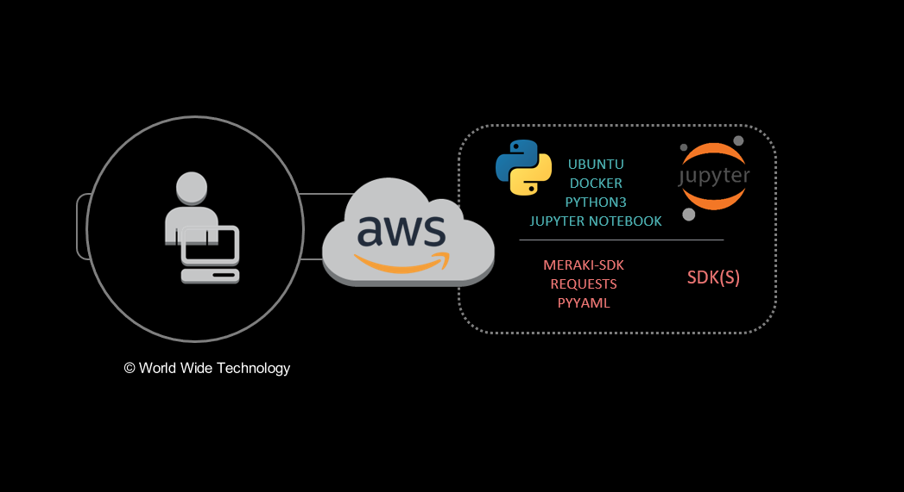

# devnet-sdk
World Wide Technology, DevNet Study Group session, 21 January 2020, **Using a SDK**.

## Overview
The engineers at World Wide Technology have formed a DevNet study group. This repository is the foundation for the DevNet certification exam study group on the topic of Software Development Kit (SDKs).  This collateral is used for exam preparation the Cisco DevNet Associate certification.

This repository provides instructions, a sample Ansible playbook, a Dockerfile, and sample Jupyter notebooks to create a learning environment on using the Meraki SDK. 



## Presentation

The companion presentation for this repository is available at [https://www.slideshare.net/joelwking/devnet-study-group-using-a-sdk](https://www.slideshare.net/joelwking/devnet-study-group-using-a-sdk).

## Project Directory Structure

In the root directory, `SANDBOX.md`  provides instructions on creating an AWS EC2 instance and installing Docker CE, either manually or using the Ansible playbook `playbooks/install_docker.yml`.

In the `library/notebooks` directory, `README.md` provides instructions on how to install and run the Docker image specified in `library/notebooks/Dockerfile`. The running container is used to execute an instance of **Jupyter notebooks**.  Within the container, Python 3, the Meraki SDK, a sample notebook (`library/notebooks/Using_a_SDK.ipynb`) and Python program (`library/notebooks/using_meraki_sdk.py`) are referenced in the lab guide `library/notebooks/MERAKI_README.md`.

### Directory Tree

```bash
devnet-sdk/
├── AUTHORS
├── CODE_OF_CONDUCT.md
├── CONTRIBUTING.md
├── images
│   └── Using_a_SDK.png
├── library
│   └── notebooks
│       ├── Dockerfile
│       ├── MERAKI_README.md
│       ├── README.md
│       ├── Using_a_SDK.ipynb
│       └── using_meraki_sdk.py
├── LICENSE
├── NOTICE
├── playbooks
│   ├── install_docker.yml
│   └── inventory.yml
├── README.md                    <- You are Here!
└── SANDBOX.md
```

## Cultural Aside
In addition to using the environment for learning how to use the Meraki SDK, Cloud computing instances running Docker and Jupyter notebooks are common for big data analytics and machine learning. Do a web search on *"why ai/ml use docker and jupyter notebooks"* - you will find a number of references to this combination of tools for AI/ML projects.

## Author
joel.king@wwt.com (@joelwking)
